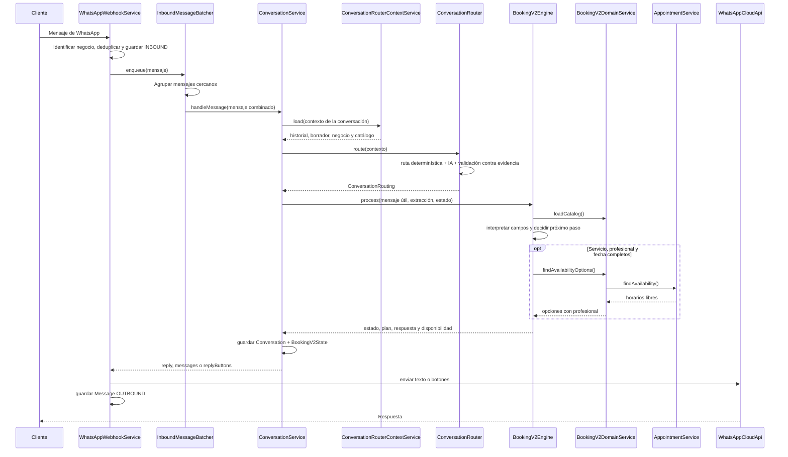
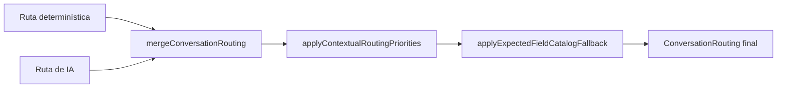
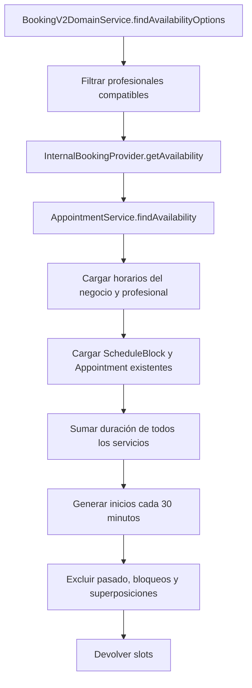

# Flujo detallado del bot actual

Fecha de relevamiento: 2026-08-08.

Este documento sigue un mensaje desde que llega a WhatsApp hasta que se envía la respuesta. Los nombres en `código` son nombres reales del proyecto. No se incluyen aquí los módulos propuestos para el futuro: el objetivo es poder analizar y depurar el bot que existe hoy.

El recorrido principal descripto es Booking V2, es decir, cuando `BusinessFeatureSettings.bookingV2Enabled = true`.

## 1. Vista completa

```mermaid
flowchart TD
    subgraph Entrada["1. Entrada y filtros previos"]
        N01["N01 WhatsAppWebhookService.handleWebhook"]
        N02["N02 Identificar negocio y deduplicar"]
        N03["N03 Guardar Message INBOUND y Conversation"]
        N04["N04 Filtros: baja, seña, posventa, bot y modo manual"]
        N05["N05 InboundMessageBatcher.enqueue"]
    end

    subgraph Contexto["2. Conversación y contexto"]
        N06["N06 ConversationService.handleMessage"]
        N07["N07 Cargar Conversation y runtime settings"]
        N08["N08 Resolver contexto pausado, vencido o reinicio"]
        N09["N09 ConversationRouterContextService.load"]
    end

    subgraph Clasificacion["3. Clasificación"]
        N10["N10 deterministicConversationRouting"]
        N11["N11 ConversationRouter: clasificación IA estructurada"]
        N12["N12 Merge, grounding y prioridades contextuales"]
        N13["N13 ConversationRouting"]
    end

    subgraph Orquestacion["4. Orquestación"]
        N14["N14 Navegación de reserva"]
        N15["N15 Turnos existentes, humano y casos especiales"]
        N16["N16 Información y presupuestos"]
        N17["N17 handleBookingV2"]
    end

    subgraph Reserva["5. Máquina de reserva"]
        N18["N18 stateFromConversation"]
        N19["N19 BookingV2DomainService.loadCatalog"]
        N20["N20 BookingV2Engine.process"]
        N21["N21 BookingV2Interpreter"]
        N22["N22 Validaciones de servicio y combinaciones"]
        N23["N23 Buscar disponibilidad"]
        N24["N24 BookingV2Dialogue y ResponseRenderer"]
        N25["N25 Persistir Conversation y BookingV2State"]
    end

    subgraph Confirmacion["6. Confirmación y salida"]
        N26["N26 BookingV2ChoiceExtractor: confirmación final"]
        N27["N27 AppointmentService.create"]
        N28["N28 BookingDepositService, si corresponde"]
        N29["N29 Componer personalidad y dividir mensajes"]
        N30["N30 WhatsAppCloudApi y Message OUTBOUND"]
    end

    N01 --> N02 --> N03 --> N04 --> N05
    N05 --> N06 --> N07 --> N08 --> N09
    N09 --> N10 --> N11 --> N12 --> N13
    N13 --> N14 --> N15 --> N16 --> N17
    N17 --> N18 --> N19 --> N20 --> N21 --> N22 --> N23 --> N24 --> N25
    N25 -->|"Faltan datos"| N29
    N25 -->|"Paso CONFIRM"| N26
    N26 -->|"Confirma"| N27
    N26 -->|"Cambia un dato"| N20
    N27 --> N28 --> N29 --> N30
```



No todos los mensajes atraviesan los treinta nodos. Una baja de promociones puede terminar en N04; una consulta de dirección puede terminar en N16; una reserva incompleta pasa por N20 y vuelve al cliente; sólo una confirmación completa llega a N27.

## 2. Secuencia de un mensaje que continúa una reserva



## 3. Nodos de entrada

### N01 — `WhatsAppWebhookService.handleWebhook`

**Entrada:** payload del webhook de Meta.

**Hace:**

1. Llama a `extractIncomingMessages`.
2. Convierte cada evento válido en texto, multimedia o respuesta interactiva.
3. Procesa cada mensaje por separado hasta que llega al agrupador.

**Salida:** lista de mensajes normalizados con teléfono, ID del proveedor, texto, multimedia, número receptor y posible `interactiveReplyId`.

**Puede finalizar aquí:** payload sin mensajes utilizables.

### N02 — identificación del negocio y deduplicación

**Módulo:** `WhatsAppWebhookService`.

**Entrada:** mensaje normalizado.

**Hace:**

- `resolveTargetBusiness` identifica el comercio según el número de WhatsApp receptor.
- `buildIncomingConversationUpsert` define la conversación por `businessId + phone`.
- Busca `Message.providerMessageId` para evitar procesar dos veces el mismo evento de Meta.

**Salida:** comercio y conversación objetivo.

**Puede finalizar aquí:** número de WhatsApp no asociado o mensaje duplicado.

### N03 — persistencia del mensaje entrante

**Módulos:** `WhatsAppWebhookService`, Prisma.

**Hace:**

- Crea o recupera `Conversation`.
- Guarda un `Message` con dirección `INBOUND`.
- Guarda como metadatos el proveedor, multimedia y respuesta interactiva.
- Actualiza `Conversation.lastMessage`, desarchiva la conversación y reabre la oportunidad si estaba cerrada.
- Vincula una referencia de Instagram si corresponde.

**Salida:** conversación persistida y `Message` entrante auditable.

### N04 — filtros previos al bot conversacional

Estos filtros ocurren antes de `ConversationRouter`.

| Orden | Módulo o validación | Qué hace | Resultado posible |
| --- | --- | --- | --- |
| 1 | `BookingDepositService.markProofReceived` | Si el archivo es comprobante de una seña pendiente, lo registra. | Confirma recepción y no entra al router. |
| 2 | `MarketingPreferenceService` | Detecta una baja explícita o semántica de promociones. | Guarda `OPTED_OUT`; puede responder inmediatamente. |
| 3 | `capturePostSaleResponse` | Interpreta una respuesta pendiente de posventa. | Guarda calificación/comentario y finaliza este mensaje. |
| 4 | `business.botEnabled` | Control general del bot del comercio. | Si está apagado, no hay respuesta automática. |
| 5 | `PhotoQuoteAcknowledgementService` | Acusa recibo de una imagen que puede servir para cotización. | Puede enviar acuse incluso en modo manual. |
| 6 | `Conversation.aiEnabled` | Indica si esta conversación está derivada a atención manual. | Si está apagado, el mensaje queda para el equipo. |
| 7 | `business.aiEnabled` | Controla si se puede usar IA; no necesariamente apaga todo el bot. | El flujo continúa con clasificación determinística. |

### N05 — `InboundMessageBatcher.enqueue`

**Entrada:** uno o más mensajes de la misma conversación.

**Hace:** espera un intervalo corto y une textos consecutivos con saltos de línea. Por ejemplo, «Hola» + «quiero corte» puede convertirse en un único texto para clasificación.

**Excepción:** respuestas interactivas y mensajes con multimedia se procesan inmediatamente.

**Salida:** un lote cuyo texto combinado entra una sola vez a `ConversationService.handleMessage`.

## 4. Nodos de conversación y contexto

### N06 — `ConversationService.handleMessage`

Es la entrada común del bot, tanto desde WhatsApp como desde la ruta interna de chat.

**Entrada principal:**

```text
phone
message
businessId
useAi
interactiveReplyId
previousActivityAt
```

**Hace:**

1. Ejecuta `handleMessageCore` dentro de `runWithAiEnabled`.
2. Si el resultado no lo evita, registra malentendidos.
3. Si el resultado lo permite, pasa la respuesta por la humanización final. Booking V2 usa su respuesta determinística personalizada y omite esa segunda llamada de IA.
4. Normaliza la salida como uno o varios mensajes.

**Salida:**

```text
reply
messages[] opcional
replyButtons[] opcional
depositRequestId opcional
```

### N07 — cargar conversación y configuración

**Módulo:** `ConversationService.handleMessageCore`.

**Hace:**

- Resuelve `businessId`.
- Carga `Conversation` por comercio y teléfono.
- Carga `bookingV2Enabled` y las ventanas de pausa/vencimiento.
- Convierte los campos persistidos a `BookingV2State` mediante `stateFromConversation`.
- Calcula si el contexto está activo, pausado o vencido.

**Decisión principal:**

```text
bookingV2Enabled = true  -> ConversationRouter + BookingV2Engine
bookingV2Enabled = false -> BookingConversationFlow
```

### N08 — contexto pausado, vencido y reinicios

**Módulos:** `ConversationService`, `BookingV2ChoiceExtractor`.

**Casos:**

- Contexto pausado: pregunta si quiere continuar, iniciar algo nuevo o hablar con una persona.
- Contexto vencido: limpia servicio, profesional, fecha, hora, disponibilidad y `bookingV2State`.
- Reinicio total: además cancela comprobantes pendientes y vuelve a `START`.
- Saludo puro inicial: responde bienvenida sin ejecutar clasificación semántica.

Este nodo evita que un «hola» varios días después continúe accidentalmente una reserva vieja.

### N09 — `ConversationRouterContextService.load`

**Entrada:** comercio, conversación, mensaje actual y `currentStep`.

**Lee en paralelo:**

- Datos públicos del negocio.
- Hasta ocho mensajes recientes.
- Servicios reservables, nombres, categorías, descripciones y alias.
- Profesionales activos que aceptan reservas del bot.
- Orden configurado del flujo.

**Produce `ConversationRouterInput`:**

```text
message
currentStep
lastBotMessage
recentMessages[]
draft { name, service, professional, date, time }
business { name, availableInformation[] }
catalog { bookingFlowOrder, services[], professionals[] }
```

El mensaje actual se quita del historial para no entregarlo dos veces al clasificador.

## 5. Cómo se clasifica el mensaje

### N10 — `deterministicConversationRouting`

Esta clasificación se calcula siempre, aunque la IA esté activa.

**Detecta con reglas:**

- Temas del negocio como dirección, horarios, redes y precios.
- Consultas puntuales contra nombres y alias del catálogo.
- Pedido explícito de presupuesto.
- Señales explícitas de querer reservar.

**Limitación:** normalmente no completa `bookingExtraction`; sirve como piso seguro y como control contra errores de IA.

**Salida inicial:** `intents`, `bookingMessage`, `catalogQuery` y `source: deterministic`.

### N11 — `ConversationRouter.route`

Si `useAi`, `business.aiEnabled` y el cliente de OpenAI están disponibles, se ejecuta una clasificación semántica con salida JSON estricta.

El clasificador recibe:

```text
mensaje actual
paso actual
última respuesta del bot
historial reciente
borrador actual
campo esperado
fecha y zona horaria
información disponible del negocio
catálogo permitido
```

Puede devolver varias intenciones a la vez. Ejemplo: «Decime la dirección y reservame un corte» contiene `business_information` y `book_appointment`.

### Intenciones actuales de `ConversationRouter`

| Intención | Significado operativo |
| --- | --- |
| `book_appointment` | Iniciar o continuar una reserva nueva. |
| `edit_booking` | Cambiar un dato del borrador actual. |
| `confirm_booking` | Confirmar la reserva completa. |
| `cancel_booking` | Abandonar la reserva que todavía se está armando. |
| `go_back` | Retroceder un paso del borrador. |
| `restart_booking` | Borrar el avance y comenzar otra reserva. |
| `cancel_appointment` | Cancelar un turno ya creado. |
| `business_information` | Consultar datos del negocio. |
| `deposit_information` | Consultar la seña. |
| `availability_preference` | Expresar fecha, día o franja preferida. |
| `professional_preference` | Elegir o preferir profesional. |
| `professional_schedule` | Consultar cuándo trabaja un profesional. |
| `service_detail` | Consultar qué incluye o cómo se realiza un servicio. |
| `unsupported_service` | Pedir un servicio que no coincide con el catálogo. |
| `request_quote` | Solicitar presupuesto o estimación personalizada. |
| `submit_media` | Avisar que envía foto o comprobante. |
| `request_human` | Pedir atención de una persona. |
| `other_query` | Anunciar otra consulta sin escribirla todavía. |
| `social_message` | Saludo, agradecimiento o charla social. |
| `stop_flow` | Terminar la conversación sin cancelar un turno creado. |
| `unknown` | No pudo determinarse una intención confiable. |

### Datos que extrae para la reserva

`bookingExtraction` evalúa por separado:

```text
name
service
additionalServices[]
professional
date
time
correction
```

Cada campo contiene `value`, `confidence` y `evidence`. Para servicio y profesional, `value` debe ser un ID presente en el catálogo recibido; no puede ser un nombre inventado.

### Ejemplo simplificado de salida

Mensaje: «Quiero corte y barba mañana con Marcos».

```text
ConversationRouting:
    intents:
        - type: book_appointment
          confidence: 0.97
          evidence: "Quiero corte y barba mañana con Marcos"
    bookingMessage: "Quiero corte y barba mañana con Marcos"
    bookingExtraction:
        service: { value: service_corte, confidence: 0.98, evidence: "corte" }
        additionalServices:
            - { value: service_barba, confidence: 0.97, evidence: "barba" }
        professional: { value: professional_marcos, confidence: 0.96, evidence: "Marcos" }
        date: { value: 2026-08-09, confidence: 0.95, evidence: "mañana" }
        time: { value: null, confidence: 0, evidence: "" }
```

### N12 — unión, grounding y prioridades

La respuesta de IA no se usa directamente. `ConversationRouter` ejecuta estas capas:



**`mergeConversationRouting`:** combina resultados, conserva coincidencias exactas del catálogo y elimina intenciones sin evidencia textual.

**`applyContextualRoutingPriorities`:** resuelve conflictos según el paso actual. Por ejemplo, una elección esperada de servicio no debe quedar tapada por una intención social genérica.

**`applyExpectedFieldCatalogFallback`:** si el bot espera servicio o profesional y el texto coincide claramente con una opción del catálogo, recupera esa selección.

Si la IA falla, falta configuración o está desactivada, se devuelve la ruta determinística. La clasificación principal resuelve en una misma llamada las intenciones, los mensajes mixtos y la extracción de campos.

### N13 — contrato `ConversationRouting`

```text
ConversationRouting:
    intents[]:
        type
        topic
        confidence
        evidence
    bookingMessage
    bookingExtraction
    catalogQuery
    source: ai | deterministic
```

`bookingMessage` es especialmente importante: contiene sólo la parte que debe avanzar la reserva. Una consulta puramente informativa deja este campo en `null` para que no altere el borrador.

## 6. Cómo se decide qué módulo actúa

### N14 a N17 — prioridad dentro de `ConversationService`

Una vez clasificado, el mensaje no va automáticamente al motor de reserva. La prioridad aproximada es:

```text
1. Navegación de la reserva actual: abandonar, volver o reiniciar.
2. Paso activo de cancelar o modificar un turno existente.
3. Mostrar los turnos del cliente.
4. Iniciar cancelación de un turno existente.
5. Iniciar modificación de un turno existente.
6. Reinicio simple.
7. Derivación humana.
8. Sumar servicio mientras existe una seña pendiente.
9. Aceptar o rechazar presupuesto de asesor.
10. Aviso de llegada.
11. Conversación ya en HUMAN_HANDOFF.
12. Conversación COMPLETED: cerrar o reabrir.
13. Información, presupuesto y casos especiales de Booking V2.
14. Reserva normal mediante BookingV2Engine.
```

### N14 — navegación de una reserva en armado

**Método:** `handleBookingV2Navigation`.

Para acciones destructivas sobre el borrador, `BookingV2ChoiceExtractor` vuelve a verificar si la persona realmente quiere cancelar, retroceder o reiniciar. Si sólo estaba haciendo una consulta, no borra el estado.

### N15 — turnos existentes y humano

**Turnos existentes:**

- `buildMyAppointmentsReply` lista próximos turnos.
- `cancelAppointmentByMessage` cancela el número elegido.
- `editAppointmentByMessage` selecciona el turno a cambiar.

**Atención humana:** cambia `currentStep` a `HUMAN_HANDOFF`, pone `Conversation.aiEnabled = false` y registra la fecha de derivación.

### N16 — información y presupuestos

**`BusinessKnowledgeService`:** responde horarios del local, dirección, servicios, precios, datos de contacto y profesionales.

**`professionalScheduleReply`:** consulta días y horarios laborales de un profesional.

**`ServiceConsultationQueue`:** procesa consultas de precio o presupuesto para varios servicios uno por uno.

**`BookingV2ServiceValidation`:** resuelve preguntas configuradas para validar si un servicio corresponde.

**Estimación guiada:** puede pedir una opción, mostrar un rango, preguntar si quiere reservar o derivar.

Una consulta informativa puede responderse y luego llamar a `BookingV2Engine.resume` para repetir la pregunta pendiente de la reserva.

### N17 — `handleBookingV2`

Es el adaptador entre el router general y `BookingV2Engine`.

**Responsabilidades:**

- Resolver información y presupuestos antes de modificar el borrador.
- Manejar servicio no soportado y malentendidos repetidos.
- Confirmar cambios de profesional.
- Interpretar la confirmación final.
- Combinar las tareas pendientes en `agenda`.
- Entregar a `BookingV2Engine` sólo el mensaje útil para la reserva.
- Persistir el resultado y componer la respuesta final.

## 7. Máquina de reserva

### N18 — `stateFromConversation`

Reconstruye un único `BookingV2State` desde:

- Los campos principales de `Conversation`: nombre, servicio, profesional, fecha, hora y contador de malentendidos.
- El JSON versionado `Conversation.bookingV2State`.

El JSON adicional contiene propuestas, consultas pendientes, validaciones, estimaciones, servicios combinados, sugerencias, seña y decisiones de separación.

### N19 — `BookingV2DomainService.loadCatalog`

Carga sólo datos que el bot puede usar:

- Servicios con `isBookable = true`.
- Profesionales activos con `acceptsBotBookings = true`.
- Relaciones `ProfessionalService`.
- Orden del flujo y modo de catálogo.
- Reglas `ServiceCombinationRule`.
- Duración, precio, seña, modo de atención, validaciones y adicionales sugeridos.

El catálogo se transforma después en versiones específicas para extracción e interpretación.

### N20 — `BookingV2Engine.process`

Orden conceptual interno:

```text
1. Cargar y sanear estado contra el catálogo actual.
2. Resolver decisiones pendientes antes de interpretar un mensaje nuevo.
3. Obtener BookingV2Extraction o usar la que preparó ConversationRouter.
4. Aplicar BookingV2Interpreter.
5. Procesar additionalServices, ambigüedades y combinedServices.
6. Mantener el flujo dentro de servicios mientras quede una ambigüedad pendiente.
7. Ejecutar validación, estimación, presupuesto o derivación del servicio.
8. Evaluar reglas de combinación.
9. Ofrecer adicionales configurados cuando corresponde.
10. Comprobar profesionales compatibles.
11. Buscar disponibilidad si ya hay servicio y fecha.
12. Construir BookingV2MessagePlan.
13. Renderizar la respuesta y devolver el nuevo estado.
```

### N21 — `BookingV2Interpreter`

**Función:** `applyBookingV2Extraction`.

Valida cada valor contra el catálogo y aplica niveles de confianza:

| Confianza | Acción actual |
| --- | --- |
| Alta: `>= 0.85` | Acepta y guarda el campo. |
| Media: `>= 0.55` y `< 0.85` | Guarda una propuesta y pide confirmación. |
| Baja: `< 0.55` con evidencia | No guarda; aumenta malentendidos y repregunta. |

Las correcciones explícitas se proponen cuando hay expresiones como «cambiar», «en realidad», «no era» o «quise decir».

Cambiar un campo invalida sus dependencias. Por ejemplo:

```text
cambiar servicio     -> invalida profesional, fecha, hora y combinación previa
cambiar profesional  -> invalida fecha/hora según el orden del flujo
cambiar fecha        -> invalida hora y disponibilidad mostrada
cambiar hora         -> invalida confirmación previa
```

### N22 — validaciones y varios servicios

Los servicios seleccionados se representan como servicio principal + `combinedServices`.

Invariante de cierre de lista: si existe `pendingServiceDisambiguation`, el próximo campo continúa siendo `service`. Una validación, estimación o sugerencia de adicionales puede terminar, pero no puede adelantar el flujo a profesional, fecha u horario hasta que todas las referencias de la lista inicial hayan sido resueltas.

Las familias reutilizan la jerarquía de variantes del catálogo: una familia no es reservable y sus hijos sí. `variantSelectionMode = ONE_OF` impide ofrecer como agregado otra variante de una familia ya seleccionada; `MULTIPLE` permite combinarlas. La categoría continúa siendo únicamente una agrupación de navegación.

Los agregados se calculan sobre toda la lista final solicitada, no sólo sobre el servicio principal. Se unifican sugerencias, se eliminan servicios ya elegidos, variantes exclusivas repetidas y combinaciones bloqueadas. La compatibilidad profesional no elimina una sugerencia comercial: se resuelve en la etapa de agenda.

La respuesta a agregados pasa primero por una decisión determinista. Negativas como «No, continuar», «sin extras» o «dejalo así», selecciones numéricas y afirmaciones con una única opción se resuelven sin IA. El extractor de elección se usa sólo cuando el texto sigue siendo semánticamente ambiguo; un «sí» frente a varias opciones repregunta cuál desea.

1. `ServiceCombinationRule = BLOCKED`: ofrece separar, cambiar o quitar.
2. `REVIEW_REQUIRED`: deriva a humano.
3. Sin bloqueo: busca un profesional que realice todos.
4. Si no hay profesional común: usa `pendingServiceSeparation`.
5. Si la persona elige separar: mueve los restantes a `queuedServices` y crea turnos sucesivos.

El bot actual no construye una visita coordinada con distintos profesionales.

### N23 — disponibilidad



Si no hay opciones para varios servicios, `findNextAvailabilityOptions` busca hasta tres fechas con horarios, dentro de un horizonte de catorce días y hasta tres horarios por fecha.

### N24 — plan y respuesta

**`BookingV2Dialogue`:** produce un `BookingV2MessagePlan`, por ejemplo:

```text
ask_field
confirm_field
confirm_correction
confirm_booking
ask_service_addons
offer_combined_availability
offer_separate_services
ask_estimate_option
ask_service_validation
handoff
```

**`BookingV2ResponseRenderer`:** convierte ese plan y el catálogo en texto obligatorio y opciones visibles para el cliente.

El plan se transforma en un `Conversation.currentStep`: `ASK_SERVICE`, `ASK_PROFESSIONAL`, `ASK_DATE`, `ASK_TIME`, `CONFIRM` o `HUMAN_HANDOFF`.

### N25 — persistencia del nuevo estado

**Módulos:** `conversationPatchFromState`, `ConversationService.updateConversation`.

Guarda:

- Campos principales seleccionados.
- `misunderstandingCount`.
- `bookingV2State` versionado.
- `lastAvailability`, con las opciones realmente ofrecidas.
- Nuevo `currentStep`.
- Estado de derivación humana cuando corresponde.

## 8. Confirmación y creación del turno

### N26 — `BookingV2ChoiceExtractor`

Cuando `currentStep = CONFIRM`, una respuesta inequívoca como «sí» puede resolverse determinísticamente. Para respuestas más complejas se clasifica entre:

```text
confirm_booking
change_service
change_professional
change_date
change_time
cancel_booking
review_options
```

Se exige confianza mínima de `0.65`. Antes de crear, también se comprueba que el profesional siga activo, acepte reservas del bot y realice el servicio principal.

### N27 — `AppointmentService.create`

Camino sin seña:

```text
ConversationService.confirmBookingV2Appointment
  -> findOrCreateCustomer
  -> InternalBookingProvider.createAppointment
  -> AppointmentService.create
```

`AppointmentService.create` vuelve a validar:

- Fecha válida.
- Profesional existente y activo.
- Servicios existentes y del mismo negocio.
- Profesional asociado a todos los servicios.
- Duración acumulada.
- Horario del negocio.
- Horario laboral del profesional.
- Bloqueos de agenda.
- Superposición con turnos existentes.

Si algo falla, limpia fecha y hora, vuelve a `ASK_DATE` y propone buscar otra opción. Si funciona, crea un `Appointment` y sus `serviceItems`.

### N28 — `BookingDepositService`

Si el servicio principal exige seña, la confirmación usa otro camino:

```text
requestBookingV2DepositIfNeeded
  -> AppointmentService.create(status = PENDING)
  -> crear BookingDeposit con vencimiento
  -> guardar pendingDeposit en BookingV2State
  -> currentStep = AWAITING_DEPOSIT
  -> enviar instrucciones de pago
```

Cuando llega una imagen compatible, N04 puede registrarla como comprobante antes de entrar a la clasificación normal.

### N29 — composición de respuesta

**Módulos:**

- `BookingV2ResponseRenderer`: contenido obligatorio.
- `AssistantPersonalityService`: aplica personalidad configurada.
- `splitWhatsAppReply`: divide mensajes largos cuando corresponde.

Booking V2 no vuelve a llamar a la IA para agregar una frase social. La personalidad se aplica de forma determinística sobre la respuesta obligatoria.

**Salida a webhook:** `reply`, `messages` o `replyButtons`.

### N30 — envío y auditoría

**Módulos:** `WhatsAppWebhookService.processAutomaticInboundBatch`, `WhatsAppCloudApi`.

1. Comprueba `assertBusinessCanSendWhatsApp`.
2. Envía texto o botones.
3. Detiene la secuencia si un envío falla.
4. Guarda cada respuesta como `Message` con dirección `OUTBOUND`.
5. Conserva ID y error del proveedor para auditoría.
6. Si falló el mensaje que pedía seña, cancela la retención para no dejar una reserva pendiente invisible al cliente.

## 9. Ejemplo completo de trazabilidad

Mensaje: «Quiero corte y barba mañana con cualquiera».

```text
N01-N03
    Se identifica el comercio, se evita duplicado y se guarda el mensaje.

N04-N05
    No es baja, comprobante ni posventa. Se agrupa y pasa al bot.

N06-N09
    Se carga la conversación, el borrador, ocho mensajes recientes,
    catálogo, profesionales y configuración.

N10-N13
    ConversationRouter devuelve:
      intent = book_appointment
      service = corte
      additionalServices = [barba]
      date = mañana
      professional = ANY_PROFESSIONAL_ID

N17-N22
    BookingV2Engine acepta campos de alta confianza, crea combinedServices,
    valida reglas y busca profesionales que hagan corte + barba.

N23
    AppointmentService suma ambas duraciones y busca bloques continuos.

N24-N25
    El bot muestra horarios, persiste lastAvailability y queda en ASK_TIME.

Mensaje siguiente: "A las 15"
    Se repite N01-N25. El horario se valida contra las opciones y el motor
    devuelve confirm_booking; la conversación queda en CONFIRM.

Mensaje siguiente: "Sí, confirmo"
    N26 confirma la intención. N27 revalida agenda y crea el turno.
    Si hay seña, N28 lo deja PENDING; si no, queda COMPLETED.
    N29-N30 generan, envían y guardan la confirmación.
```

## 10. Cómo usar este mapa para depurar

Ante un comportamiento incorrecto, localizar primero el nodo donde apareció la primera diferencia:

| Síntoma | Primer nodo a revisar |
| --- | --- |
| El mensaje llegó dos veces | N02, deduplicación por `providerMessageId`. |
| Dos mensajes cortos se entendieron separados | N05, `InboundMessageBatcher`. |
| Retomó una reserva vieja | N08, ventana de contexto. |
| Confundió consulta con reserva | N10-N13, `ConversationRouting`. |
| Eligió un servicio incorrecto | N09 catálogo + N12 grounding + N21 validación. |
| Respondió información pero perdió la reserva | N16 y `BookingV2Engine.resume`. |
| Pidió un dato que ya estaba dicho | N11 extracción + N21 aplicación de confianza. |
| Ofreció un profesional incompatible | N19 relaciones + N22 compatibilidad. |
| No encontró horario que parecía libre | N23 duración, horas, bloqueos y superposición. |
| Se ocupó antes de confirmar | N27 revalidación al crear. |
| Se creó con servicios equivocados | N22 `combinedServices` + N27 `serviceItems`. |
| No respondió después de derivar | N04 `Conversation.aiEnabled = false`; es comportamiento esperado. |
| Envió la respuesta pero no figura en CRM | N30 persistencia de `Message OUTBOUND`. |
