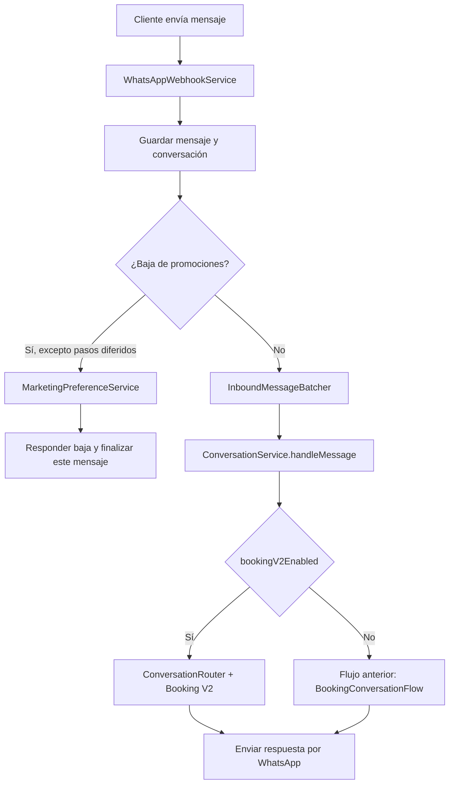
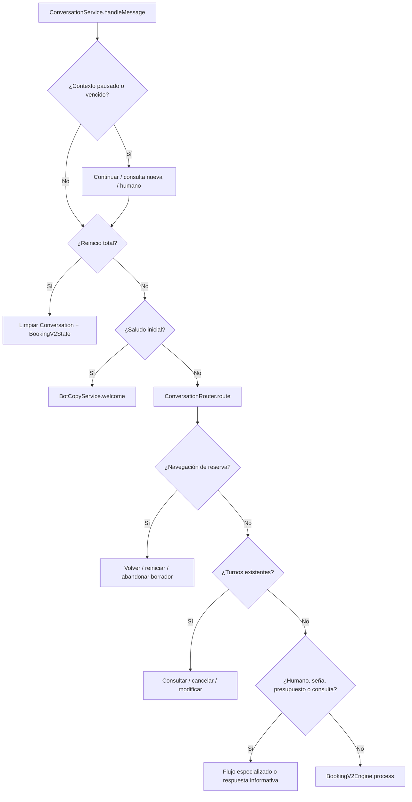
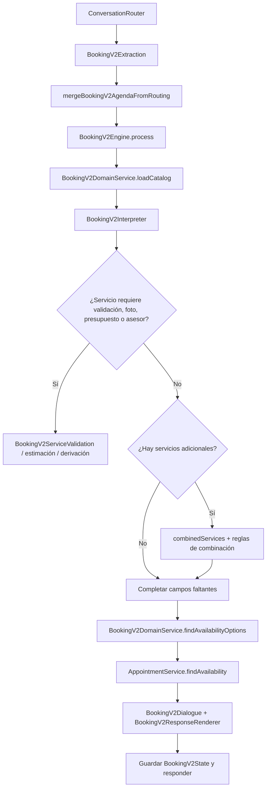
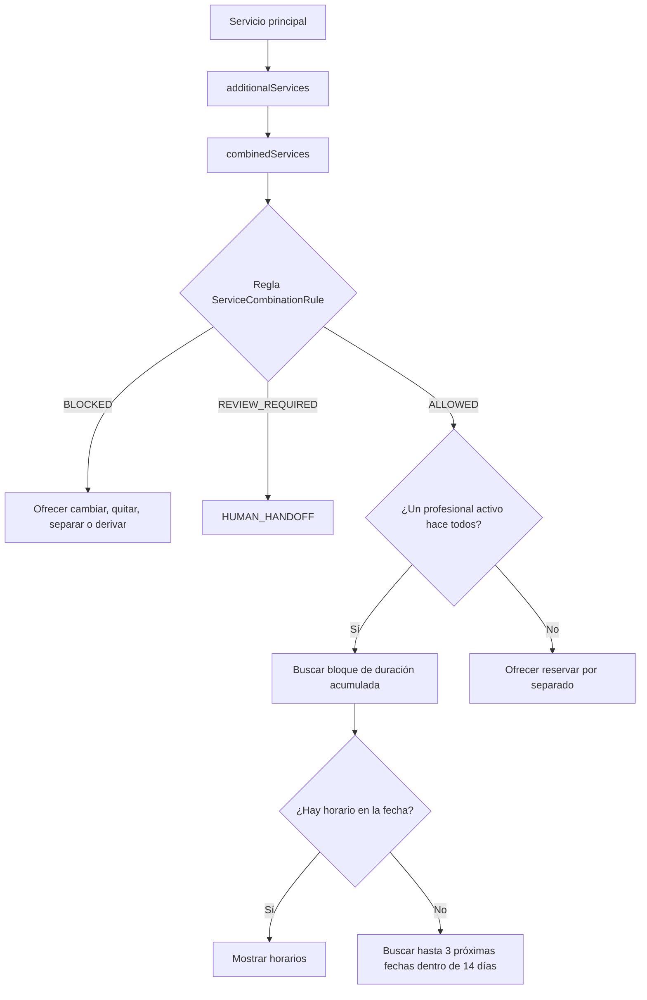
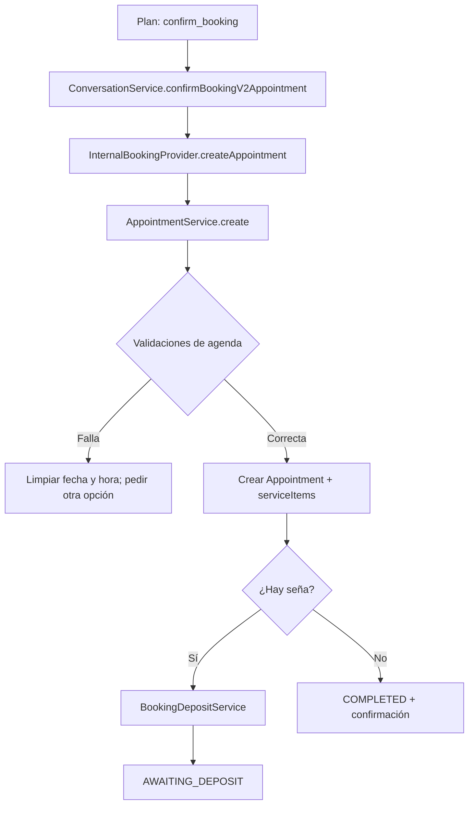
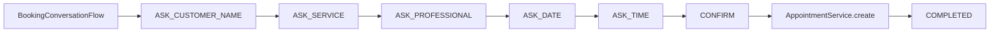

# Mapa del bot actual

Fecha de relevamiento: 2026-08-08. Este documento describe el comportamiento que se desprende del código actual; no es un diseño deseado. Los nombres en `código` corresponden a módulos que ya existen. Todo elemento marcado como **Propuesto** no existe todavía.

## Lectura rápida

El bot tiene dos recorridos de reserva seleccionados por `BusinessFeatureSettings.bookingV2Enabled`:

- `false`: `BookingConversationFlow`, el flujo anterior de un solo servicio.
- `true`: `ConversationService` + `ConversationRouter` + `BookingV2Engine`, el flujo activo más completo. Este es el que maneja servicios combinados, presupuestos, estimaciones, señas y recuperación de contexto.

## 1. Camino real de un mensaje de WhatsApp



### Módulos existentes y su rol

| Módulo existente | Responsabilidad actual |
| --- | --- |
| `WhatsAppWebhookService` | Recibe mensajes, persiste historial, detecta baja de promociones, agrupa mensajes cercanos y envía respuestas. |
| `InboundMessageBatcher` | Une mensajes consecutivos para interpretar una sola intención. Las respuestas interactivas y multimedia se procesan inmediatamente. |
| `ConversationService` | Orquesta la conversación: contexto pausado, reinicios, consultas, cancelación/modificación, derivación humana y la reserva. |
| `ConversationRouterContextService` | Arma el contexto que se entrega al enrutador: conversación, catálogo y datos actuales. |
| `ConversationRouter` | Clasifica intenciones y extrae posibles datos de reserva. Usa IA con salida estructurada y una alternativa determinística. |
| `BookingV2Engine` | Es la máquina de estados de la reserva nueva. Actualiza `BookingV2State`, consulta agenda y decide el siguiente plan de mensaje. |
| `BookingV2DomainService` | Carga catálogo, profesionales, reglas de combinación y traduce la consulta de disponibilidad. |
| `AppointmentService` | Calcula disponibilidad y valida la creación/modificación del turno contra agenda, horario laboral, bloqueos y superposiciones. |
| `BookingDepositService` | Gestiona la reserva pendiente y la seña cuando el servicio la requiere. |
| `BusinessKnowledgeService` | Contesta información del negocio, servicios, precios y profesionales sin perder el contexto de reserva. |

La baja existente es específicamente de promociones: marca `CustomerMarketingPreference` como `OPTED_OUT`. El mensaje de confirmación aclara que recordatorios y mensajes sobre turnos continúan activos.

## 2. Prioridades dentro de `ConversationService`

Antes de mandar un texto a `BookingV2Engine`, `ConversationService` resuelve varias interrupciones y casos especiales. El orden importa porque define qué puede interrumpir una reserva en curso.



Las acciones de turno existente usan `CANCEL_SELECT_APPOINTMENT` y `EDIT_SELECT_APPOINTMENT`. La atención humana usa `HUMAN_HANDOFF`, desactiva la IA de esa conversación y evita que el bot siga respondiendo.

## 3. Reserva nueva activa: `Booking V2`



`BookingV2State` ya guarda bastante más que los cinco datos del turno. Entre otros: propuesta pendiente, agenda de consultas, navegación de catálogo, validación del servicio, estimación guiada, presupuesto de asesor, seña, servicios en cola, `combinedServices`, sugerencias de adicionales, disponibilidad próxima y separación de servicios.

### Seudocódigo fiel al recorrido actual

```text
function procesarReservaV2(mensaje, conversation, routing):
    estado = stateFromConversation(conversation)

    if consultaDePrecioParaVariosServicios(routing):
        return iniciarColaDeConsultasDePrecio(estado)

    if presupuestoSolo(routing):
        return iniciarColaDePresupuestos(estado)

    if consultaDeNegocioOServicio(routing) y no contienePedidoDeReserva:
        respuesta = BusinessKnowledgeService.answer(...)
        return responderY, si corresponde, retomar(BookingV2Engine.resume)

    if servicioNoSoportadoRepetido(routing, estado):
        return derivarHumano()

    estado = mergeBookingV2AgendaFromRouting(estado, routing)
    resultado = BookingV2Engine.process({
        conversation: conversationPatchFromState(estado),
        message: routing.bookingMessage o mensaje,
        understandingExtraction: routing.bookingExtraction
    })

    guardar(
        currentStep = conversationStepFromBookingV2Plan(resultado.plan),
        bookingV2State = resultado.conversationPatch.bookingV2State,
        lastAvailability = resultado.availabilityOptions
    )
    return componerRespuesta(resultado.reply, personalidadDelAsistente)
```

## 4. Varios servicios: lo que hoy sí hace



`BookingV2DomainService.findAvailabilityOptions` filtra primero los profesionales que hacen **todos** los servicios elegidos. Luego `AppointmentService.findAvailability` suma las duraciones y busca un bloque continuo para ese único profesional. Si no existe un profesional común, el estado pasa a `pendingServiceSeparation`.

Si la persona acepta separar, `BookingV2Engine` mueve los restantes a `queuedServices`: confirma una reserva y luego vuelve a iniciar la siguiente. Es una secuencia de reservas independientes, no una combinación coordinada en la misma visita.

## 5. Confirmación, agenda y seña



`AppointmentService.create` vuelve a comprobar que el profesional y los servicios pertenezcan al negocio, que el profesional los realice, que el bloque entre en los horarios de negocio y profesional, que no haya bloqueos de agenda ni superposición de turnos. Para varios servicios del mismo profesional crea un único `Appointment` con múltiples `serviceItems` y una duración total acumulada.

## 6. Flujo anterior, aún reutilizable cuando `bookingV2Enabled = false`



Este flujo no guarda una lista de servicios ni usa `BookingV2State`; funciona con los campos de conversación seleccionados (`selectedServiceId`, `selectedProfessionalId`, `selectedDate` y `selectedTime`). Es importante no mezclar sus reglas con Booking V2 al depurar un comercio: el interruptor `bookingV2Enabled` decide cuál de los dos procesará los mensajes.

## 7. Diferencia concreta con el flujo de referencia

| Necesidad | Estado actual | Nombre a reutilizar o crear |
| --- | --- | --- |
| Varios servicios con un mismo profesional y bloque continuo | Implementado | `BookingV2Engine`, `BookingV2DomainService`, `AppointmentService` |
| Reglas bloquear / revisar combinaciones | Implementado | `ServiceCombinationRule` |
| Próximos horarios para una combinación con profesional común | Implementado | `findNextAvailabilityOptions` |
| Separar servicios en reservas sucesivas | Implementado | `queuedServices` y `advanceToNextQueuedService` |
| Varios profesionales coordinados en una sola visita | No implementado: si no hay profesional común se ofrece separar o derivar | **Propuesto: `MultiProfessionalBookingPlanner`** |
| Modelo de segmentos por profesional, con transición y recursos | No implementado | **Propuesto: `BookingPlan` y `BookingSegment`** |
| Reserva atómica para varios profesionales | No implementado | **Propuesto: `AppointmentService.createComposite`** |
| Idempotencia explícita al crear reservas | No aparece en el flujo relevado | **Propuesto: `BookingIdempotencyService`** |
| Baja de toda comunicación | No implementado como tal; existe baja de promociones | **Propuesto: `CommunicationPreferenceService`**, sin reemplazar `MarketingPreferenceService` |

## 7.1. Comprensión optimizada

El camino productivo de Booking V2 usa `ConversationRouter` como única comprensión general por mensaje. Esa llamada devuelve intención y `bookingExtraction`; `ConversationService` entrega explícitamente esa extracción —o `null`— a `BookingV2Engine`, evitando una segunda extracción automática. La respuesta de reserva se renderiza y personaliza de forma determinística, sin otra llamada de IA para agregar una frase social.

## 8. Punto de extensión recomendado

El nuevo planificador debe incorporarse en `BookingV2DomainService`, antes de `findAvailabilityOptions`, sin reemplazar `BookingV2Engine`. El motor ya tiene los lugares correctos para decidir: `combinedServices`, reglas de combinación, `pendingServiceSeparation`, disponibilidad próxima y confirmación.

```text
# Estado actual
BookingV2Engine
  -> BookingV2DomainService.findAvailabilityOptions
  -> AppointmentService.findAvailability
  -> sólo profesionales que hacen todos los servicios

# Extensión propuesta
BookingV2Engine
  -> BookingV2DomainService.findAvailabilityPlan
  -> MultiProfessionalBookingPlanner
       -> AppointmentService.findAvailability para cada segmento
       -> devuelve BookingPlan con 1 o más BookingSegment
  -> AppointmentService.createComposite(BookingPlan)
```

No se debería modificar `ConversationRouter` para resolver combinaciones de profesionales: su responsabilidad actual es entender el mensaje y extraer preferencias. La compatibilidad, duración, secuencia y ocupación deben seguir siendo decisiones determinísticas del dominio y de la agenda.

## 9. Lista de revisión al encontrar un problema

1. Confirmar si el comercio tiene `bookingV2Enabled` activo; de eso depende el recorrido.
2. Encontrar el `currentStep` y el `bookingV2State` de la conversación.
3. Verificar el resultado de `ConversationRouter` antes de tocar el motor.
4. Si el problema es de horario, comprobar catálogo, vínculos `ProfessionalService`, duración, horas, bloques y turnos en `AppointmentService`.
5. Si hay varios servicios, determinar si el caso requiere profesional común, separación actual o el nuevo planificador propuesto.
6. Convertir el caso en una prueba de los contratos existentes: `booking-v2`, `multi-service-booking`, `combined-service-conversations` o `appointment-payload`.
