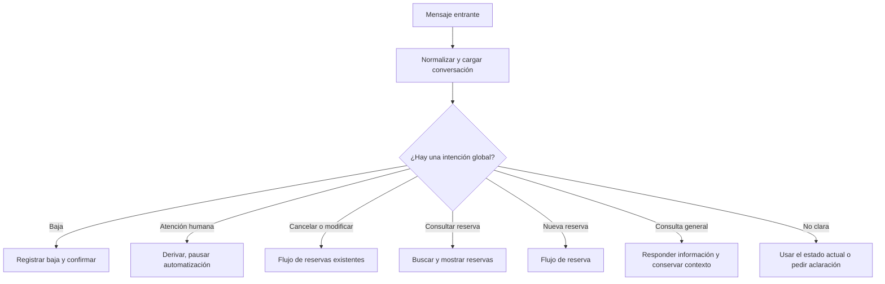
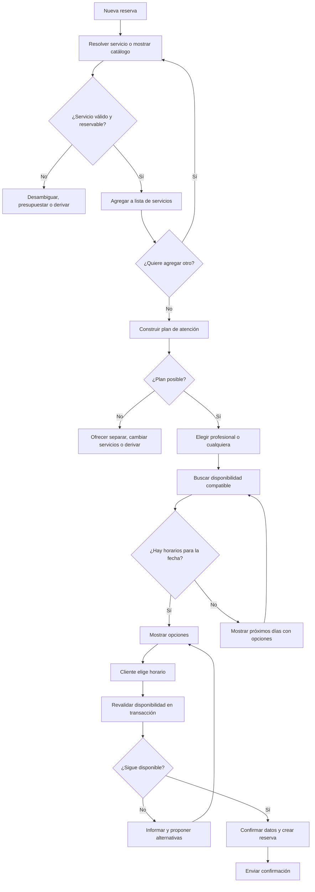

# Flujo de referencia del bot de reservas

## Propósito

Este documento es la fuente de verdad funcional para revisar el bot antes de cambiar código. La regla central es simple: la IA entiende el mensaje y redacta respuestas; el backend decide el estado, los servicios válidos, la disponibilidad y la creación de una reserva.

Una conversación conserva un `BookingState`. No se infiere el siguiente paso únicamente desde el último texto enviado al cliente.

## 1. Enrutador de mensajes

Cada mensaje entrante se procesa primero como una interrupción potencial. Por ejemplo, una persona puede estar eligiendo horario y escribir «cancelá», «quiero hablar con alguien» o «no me manden más mensajes».



### Seudocódigo: procesamiento de un mensaje

```text
function procesarMensaje(mensaje, conversationId, businessId):
    conversacion = cargarConversacion(conversationId, businessId)
    estado = cargarEstado(conversacion)
    datos = IA.extraerIntencionYDatos(mensaje, contextoMinimo(estado))

    # Las interrupciones siempre tienen prioridad sobre el paso actual.
    if datos.intencion == BAJA:
        crm.desactivarMensajes(conversacion.clienteId)
        return responderYGuardar("Listo, no te enviaremos más mensajes.", estado.finalizar())

    if datos.intencion == ATENCION_HUMANA:
        estado = estado.pausarPorHumano()
        crm.crearDerivacion(conversacion, motivo=datos.motivo)
        return responderYGuardar("Te derivamos con el equipo.", estado)

    if datos.intencion in [CANCELAR_RESERVA, MODIFICAR_RESERVA, CONSULTAR_RESERVA]:
        return procesarReservaExistente(datos, conversacion, estado)

    if datos.intencion == CONSULTA_GENERAL:
        respuesta = responderConsulta(datos)
        return responderYGuardar(respuesta, estado.sinCambiarPaso())

    if datos.intencion == NUEVA_RESERVA or estado.perteneceAReservaNueva():
        return procesarNuevaReserva(datos, conversacion, estado)

    return pedirAclaracion("¿Querés reservar, consultar una reserva o hablar con el equipo?", estado)
```

## 2. Estado mínimo de una nueva reserva

```text
BookingState:
    clienteId
    paso
    servicios[]                 # Cada item guarda id, duración y reglas vigentes.
    preferenciaProfesional      # profesionalId | CUALQUIERA | null
    preferenciaFecha            # fecha | rango de fechas | null
    opcionHorariaMostrada[]     # opciones que el bot ofreció realmente
    seleccionTemporal           # opción elegida, aún no confirmada
    planDeAtencion              # un profesional continuo o segmentos compatibles
    reservaIdempotencyKey       # evita duplicar reservas al reintentar
    pausadoPorHumano

ServicioSeleccionado:
    serviceId
    nombreMostrado
    duracionMinutos
    modoAtencion                # reserva directa | presupuesto | asesor | estimación guiada
    profesionalesHabilitados[]
```

No conviene guardar sólo nombres como «corte» o «barba». El estado debe conservar los identificadores de catálogo: los nombres cambian, los identificadores no.

## 3. Flujo de nueva reserva



### Seudocódigo: lista de servicios

```text
function procesarNuevaReserva(datos, conversacion, estado):
    estado = aplicarDatosConfirmados(estado, datos)

    if estado.paso == ELEGIR_SERVICIO:
        coincidencias = catalogo.buscarServicios(datos.texto, datos.serviceIds)

        if coincidencias.vacias():
            return pedirServicioOMostrarCatalogo(estado)

        if coincidencias.esAmbigua():
            estado = estado.esperarDesambiguacion(coincidencias)
            return mostrarOpcionesDeServicio(coincidencias, estado)

        servicio = coincidencias.unica()
        resultado = validarModoDeAtencion(servicio, datos)
        if resultado.requierePresupuestoOAsesor:
            return iniciarFlujoNoReservableDirectamente(resultado, estado)

        estado.servicios.agregarSiNoExiste(servicio)
        estado.paso = CONFIRMAR_OTRO_SERVICIO
        return preguntar("¿Querés agregar otro servicio a la reserva?", estado)

    if estado.paso == CONFIRMAR_OTRO_SERVICIO:
        if datos.respuesta == SI:
            estado.paso = ELEGIR_SERVICIO
            return pedirServicioOMostrarCatalogo(estado)

        if datos.respuesta == NO:
            estado.planDeAtencion = resolverPlanDeAtencion(estado.servicios)
            return continuarSegunPlan(estado)

        return repetirPreguntaDeAgregarServicio(estado)

    return continuarPasoActual(datos, estado)
```

## 4. Regla crítica: varios servicios

La disponibilidad de servicios no se puede comprobar de forma independiente. Que haya un hueco para un corte a las 14:00 y otro para claritos a las 14:30 no significa que la combinación sea reservable.

El motor debe crear un `planDeAtencion` antes de buscar horarios.

```text
function resolverPlanDeAtencion(servicios):
    profesionalesComunes = interseccion(
        servicio.profesionalesHabilitados para cada servicio en servicios
    )

    if profesionalesComunes.noVacia():
        return PlanContinuo(
            profesionalesElegibles=profesionalesComunes,
            duracionTotal=sumarDuraciones(servicios),
            serviciosEnOrden=ordenarServicios(servicios)
        )

    combinaciones = generarCombinacionesDeProfesionales(servicios)
    combinacionesValidas = filtrar(combinaciones, respetaReglasDeNegocio)

    if combinacionesValidas.vacia():
        return PlanImposible(razon=NO_HAY_PROFESIONAL_COMPATIBLE)

    return PlanPorSegmentos(
        combinaciones=combinacionesValidas,
        segmentos=serviciosEnOrdenConProfesional,
        requiereContinuidad=true,
        tiempoDeTransicionMinutos=configuracion.tiempoDeTransicion
    )
```

Una combinación por segmentos sólo es válida si todos los segmentos caben, en orden, sin superponerse y con el tiempo de transición definido por el salón. Si esa regla no se cumple, el bot no debe presentar el horario como disponible.

```text
function buscarDisponibilidad(plan, fecha, preferenciaProfesional):
    candidatos = aplicarPreferenciaProfesional(plan, preferenciaProfesional)

    if plan.tipo == CONTINUO:
        return agenda.buscarBloquesLibres(
            profesionales=candidatos,
            fecha=fecha,
            duracionMinutos=plan.duracionTotal
        )

    opciones = []
    for combinacion in candidatos:
        for inicio in agenda.iniciosPosibles(fecha):
            reloj = inicio
            segmentos = []
            for segmento in plan.segmentos:
                profesional = combinacion.profesionalPara(segmento.serviceId)
                if not agenda.estaLibre(profesional, reloj, segmento.duracion):
                    break
                segmentos.agregar({profesional, inicio: reloj, duracion: segmento.duracion})
                reloj = reloj + segmento.duracion + plan.transicionDespues(segmento)

            if segmentos.cubreTodosLosServicios():
                opciones.agregar({inicio, segmentos})

    return ordenarYLimitar(opciones)
```

Si el negocio no permite coordinar dos profesionales en una sola visita, `resolverPlanDeAtencion` debe devolver `PlanImposible`; luego se le ofrecen tres salidas claras: cambiar/quitar servicios, reservarlos por separado, o hablar con una persona.

## 5. Fecha y horario

```text
function continuarSegunPlan(estado):
    if estado.planDeAtencion.esImposible:
        estado.paso = RESOLVER_SERVICIOS_INCOMPATIBLES
        return ofrecerSepararCambiarODerivar(estado)

    if estado.preferenciaProfesional.esNula() and negocio.pideElegirProfesional:
        estado.paso = ELEGIR_PROFESIONAL
        return mostrarProfesionalesCompatiblesOMostrarCualquiera(estado)

    if estado.preferenciaFecha.esNula():
        estado.paso = ELEGIR_FECHA
        return pedirFecha(estado)

    return buscarYOfrecerHorarios(estado)

function buscarYOfrecerHorarios(estado):
    opciones = buscarDisponibilidad(
        estado.planDeAtencion,
        estado.preferenciaFecha,
        estado.preferenciaProfesional
    )

    if opciones.noVacia():
        estado.opcionHorariaMostrada = opciones
        estado.paso = ELEGIR_HORARIO
        return mostrarHorarios(opciones, estado)

    fechas = agenda.buscarProximasFechasConDisponibilidad(
        plan=estado.planDeAtencion,
        desde=diaSiguiente(estado.preferenciaFecha),
        limite=5
    )
    estado.paso = ELEGIR_OTRA_FECHA
    return mostrarFechasDisponibles(fechas, estado)
```

El cliente sólo puede seleccionar una opción incluida en `opcionHorariaMostrada`, salvo que el mensaje contenga una fecha/hora nueva que vuelve a pasar por la búsqueda. Así se evita confirmar una hora que nunca fue evaluada para el plan completo.

## 6. Confirmación y creación segura

La confirmación no es una suposición del modelo. Es una operación del backend que vuelve a revisar todos los recursos ocupados y crea la reserva de forma atómica.

```text
function confirmarReserva(estado, respuestaCliente):
    if respuestaCliente != CONFIRMA:
        return corregirCampoIndicadoOVolverAResumen(estado)

    opcion = resolverOpcionElegida(respuestaCliente, estado.opcionHorariaMostrada)
    if opcion.esNula():
        return pedirQueElijaUnaOpcionMostrada(estado)

    resultado = baseDeDatos.transaccion(() => {
        bloquearAgenda(opcion.profesionales, opcion.rangoCompleto)

        if not agenda.sigueDisponible(opcion.segmentos):
            return {estado: YA_OCUPADO}

        reserva = reservas.crearConSegmentos({
            clienteId: estado.clienteId,
            servicios: estado.servicios,
            segmentos: opcion.segmentos,
            idempotencyKey: estado.reservaIdempotencyKey
        })
        return {estado: CREADA, reserva}
    })

    if resultado.estado == YA_OCUPADO:
        estado.opcionHorariaMostrada = []
        return buscarYOfrecerHorarios(estado)

    estado.paso = RESERVA_CREADA
    return enviarConfirmacion(resultado.reserva, estado)
```

La misma clave de idempotencia debe devolver la reserva ya creada si WhatsApp reintenta el mensaje o si llegan dos eventos iguales. Nunca debe crear dos turnos.

## 7. Flujos fuera de nueva reserva

```text
function procesarReservaExistente(datos, conversacion, estado):
    reservas = reservas.buscarFuturasDelCliente(conversacion.clienteId)

    if datos.intencion == CONSULTAR_RESERVA:
        return mostrarReservas(reservas)

    reserva = identificarReserva(datos, reservas)
    if reserva.esAmbigua():
        return pedirQueElijaReserva(reservas)

    if datos.intencion == CANCELAR_RESERVA:
        return solicitarConfirmacionDeCancelacion(reserva)

    if datos.intencion == MODIFICAR_RESERVA:
        return iniciarNuevaReservaConContexto(
            clienteId=conversacion.clienteId,
            servicios=reserva.servicios,
            reservaOriginalId=reserva.id
        )
```

Para modificar, primero se obtiene y confirma un nuevo horario. Sólo después se cancela o reemplaza el turno anterior, dentro de una operación coherente. Así no se pierde un turno por no encontrar alternativa.

## 8. Responsabilidades sin ambigüedad

| Capa | Decide | No decide |
| --- | --- | --- |
| IA | Intención, servicios mencionados, preferencia de fecha, elección expresada y texto de respuesta | Si un servicio existe, qué horario queda libre, el precio final, ni crear una reserva |
| Motor de reserva | Siguiente paso, validaciones, plan de uno o varios servicios, alternativas y confirmación | Interpretar libremente lenguaje natural |
| Agenda | Horarios laborales, bloqueos, duraciones, recursos y colisiones | El tono del mensaje |
| CRM y mensajería | Cliente, historial, baja, derivación humana, envío y auditoría | Disponibilidad o reglas de agenda |

## 9. Reglas de seguridad funcional

1. Toda elección de IA se valida contra catálogo y estado antes de persistirla.
2. Se pregunta una sola decisión por mensaje; se evita mezclar servicio, fecha y confirmación en una misma pregunta.
3. Cualquier cambio de servicio invalida profesional, plan, horarios ofrecidos y confirmación previa.
4. Cualquier cambio de profesional invalida horarios ofrecidos y confirmación previa.
5. Cualquier cambio de fecha invalida horarios ofrecidos y confirmación previa.
6. Nunca se muestra como disponible un horario sin ejecutar la búsqueda para el plan completo.
7. Antes de crear, se vuelve a validar dentro de una transacción.
8. Tras varios malentendidos o una regla no automatizable, se deriva a una persona y se pausa el bot.
9. Cancelar, modificar, atención humana y baja interrumpen el flujo actual de forma segura.
10. Cada transición deja un registro de entrada, decisión, estado anterior y estado siguiente para poder depurarla.

## 10. Casos que deben existir como pruebas de aceptación

```text
CASO 1: Un servicio, un profesional y un horario libre -> crea una reserva.
CASO 2: El cliente agrega un servicio compatible -> busca un bloque continuo con duración total.
CASO 3: Dos servicios sin profesional común, con combinación coordinable -> muestra sólo combinaciones completas.
CASO 4: Dos servicios sin profesional común y sin combinación -> ofrece separar, cambiar o derivar.
CASO 5: No hay horario para la fecha -> propone próximos días que sí cumplen todo el plan.
CASO 6: La opción se ocupa antes de confirmar -> no crea reserva y presenta alternativas.
CASO 7: El cliente cambia un servicio después de elegir hora -> invalida hora y vuelve a buscar.
CASO 8: Un mismo evento entrante llega dos veces -> crea una única reserva.
CASO 9: El cliente pide humano en cualquier paso -> pausa la automatización y deriva.
CASO 10: El cliente pide baja en cualquier paso -> registra la baja y no sigue ofreciendo turnos.
```

## 11. Cómo usarlo para corregir el producto

Antes de modificar un comportamiento, identificar primero: (1) el paso de entrada, (2) los datos que cambian, (3) las dependencias que se invalidan, (4) la salida para el caso sin disponibilidad y (5) la prueba de aceptación que lo demuestra.

En el código actual, el motor `src/services/booking-v2-engine.ts`, el estado `src/services/booking-v2-state.ts` y las pruebas de reserva combinada son los puntos naturales para contrastar este flujo. Este documento describe el contrato deseado; no asume que cada rama ya esté implementada.
